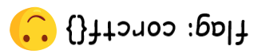
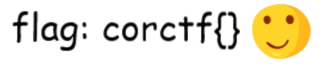

# Introduction

Kcehc Ytinas is a challenge based on sanity check.

Sanity check is a simple test that checks for obvious errors. 
This check is often done to determine whether something that occurred is possible or not.

The name of the challenge is "sanity check" but with the letters orderedly _reversely_, or from back to front. 
Knowing this can help us solve the challenge and obtain the flag!

## misc/kcehc-ytinas

### Challenge Description:

This challenge has nothing hidden or tricky about it - just type what you see in the image above.

Note: Our main point of contact is our [Discord server](https://discord.com/invite/4e8zemZe3y). We will be providing support for challenges and posting announcements and challenge updates here. While not strictly required , it is recommended to join the Discord, as it will be the fastest way to contact us.

Enjoy the CTF!

### Solution:

In order to pass the sanity check, you can directly do what the description says.

Recall that the name of the challenge is "sanity check" but reversed, so do the same by _reversing the image around the center point_.

That is just another way to say _rotate the image by 180°_.

(The image shows the text "flag: corctf{}")

---

Flag: `corctf{}`